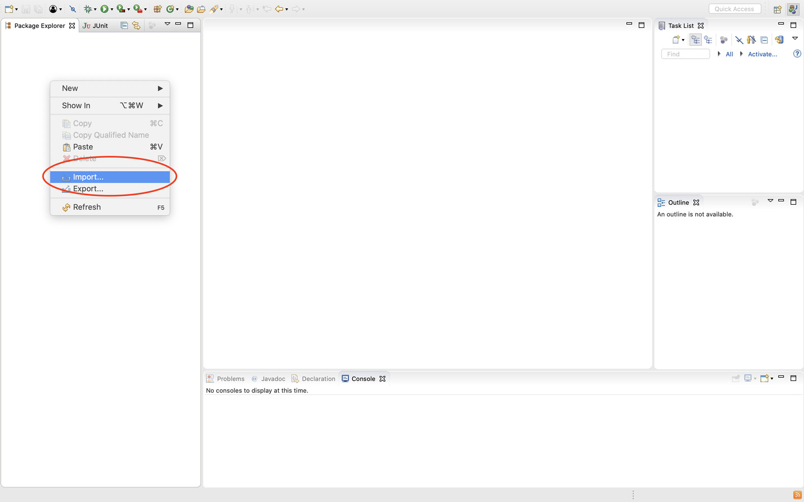
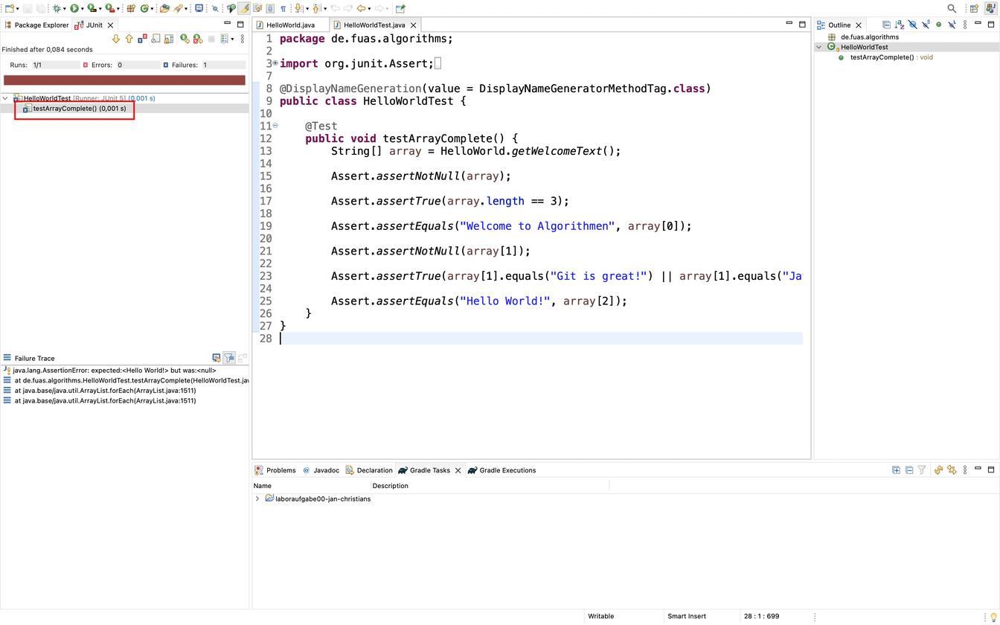
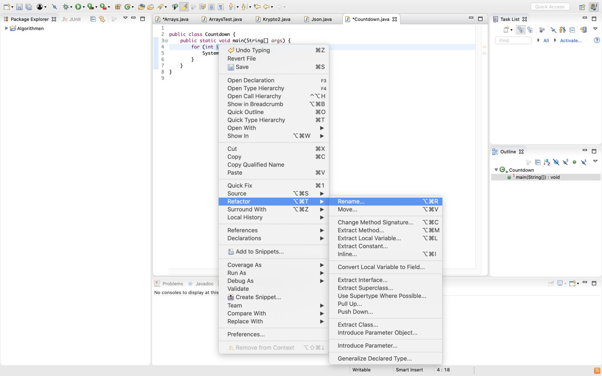
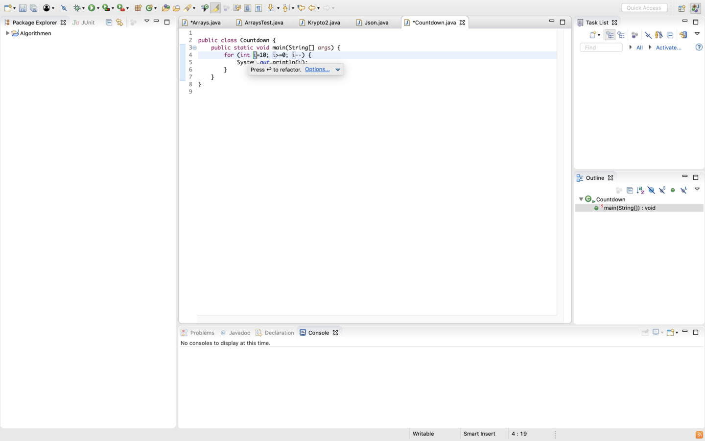

1. [Import eines Projektes](#import-eines-projektes)

2. [Ausführen von JUnit-Testfällen](#ausführen-von-junit-testfällen)

3. [Refactorings](#refactorings)

4. [Einstellungen](#einstellungen)

5. [Bekannte Probleme](#bekannte-probleme)

 

## Import eines Projektes

Für jede Aufgabenserie wird ein GitHub\-_Repository_ zur Verfügung gestellt.
Um den darin zur Verfügung gestellten Code zu nutzen, kann er wie folgt in Eclipse importiert werden.
Mit einem Rechtsklick im `Package Explorer` oder über die Menüleiste unter `File` und dann `Datei` den Menüpunkt `Import...` auswählen.

Anschließend wählt ihr die Art, in dem das zu importierende Repository vorliegt. In diesem Fall handelt es sich um `Existing Gradle Project.`.

Im nachfolgenden Schritt wählt ihr den Pfad des Ordners für die entsprechende Serie aus.
Der Knopf `Browse...` kann genutzt werden, um das Verzeichnis zu suchen.

Die Bearbeitung der Aufgaben nehmt ihr im Ordner `/src/main/java/` vor.
Die _Repositories_ enthalten immer ein Paket `de.fuas.algorithms`, in dem die Java-Dateien liegen sollten.

Wenn die Aufgabenstellung Testfälle zur Verfügung stellt, können diese mit einem Klick der rechten Maustaste und den Menüpunkt `Run As JUnit Test` ausgeführt werden.

  

## Ausführen von _JUnit_-Testfällen

Statt mit dem Rechtsklick, wie zuvor gezeigt, könnt ihr die Tests einer einzelnen Testklasse auch ausführen, indem ihr die Klasse öffnet und auf den _Play_-Knopf drückt.

Nach dem Ausführen erhaltet ihr das Testergebnis.
Als Bezeichnung für den Test wird der Name der Test-Methode verwendet.
In diesem Fall heißt die Methode zum Beispiel `testArrayComplete`.
So könnt ihr nachvollziehen, bei welchem Test es vielleicht noch Schwierigkeiten gibt.
In diesem Fall war der Test nicht erfolgreich.
Dies ist an dem roten Balken, als auch an dem Icon am Testfall zu erkennen.
Die Icons an den Testfällen zeigen das Ergebnis für den jeweiligen Test an.
Der obige Balken trifft eine Aussage darüber, ob ALLE Tests erfolgreich waren oder nicht.

Nachdem alle Fehler behoben wurden und die geprüfte Methode alle Testvoraussetzungen erfüllt, ist folgendes zu sehen:
Das Icon am Testfall zeigt, dass der einzelne Test erfolgreich war.
In diesem Beispiel war `testArrayComplete` erfolgreich.
Da damit alle Tests in dieser Klasse erfolgreich waren, wird der Balken grün angezeigt.

 

## Refactorings

### Umbenennen mehrerer Vorkommen eines Variablen-/Methoden-/Klassennamens

Um mehrere Vorkommen eines Variablennamens umbenennen zu können, geht ihr am besten wie folgt vor:
Zuerst markiert ihr eines der Vorkommen.

Anschließend klickt ihr mit der rechten Maustaste auf den zu ändernden Namen, wählt `Refactor` und `Rename...` aus.

Nun ist der Modus zum Umbenennen aktiviert...

... und ihr könnt den bisherigen Namen verändern.

In diesem Modus werden alle Vorkommen der Variable gleichzeitig verändert.
Dieser Weg zum Umbenennen kann euch einige Zeit sparen, da es recht mühsam sein kann, alle Vorkommen einer Variable umzubenennen.
Bestätigt abschließend mit _Enter_ den neuen Namen.

 

## Einstellungen

### Einstellungen des Code-Formatters

Über die Menüleiste unter `Window` den Menüpunkt `Preferences` auswählen.[^macos]

[^macos]: Unter MacOS ist der Menüpunkt `Preferences` im Anwendungsmenü zu finden, also unter dem Menüpunkt `Eclipse`.

Im Einstellungsfenster navigiert ihr zu dem Punkt `Java`, dann `Code Style` und schließlich `Formatter`.

Unter den Einstellungen muss nun ein neues Profil angelegt werden, dazu klickt ihr auf den Button `New...`.

Im Konfigurationsdialog wählt ihr den Profilnamen `Algorithmen` und als Vorgabeprofil `Eclipse [built-in]`. Da das Profil noch bearbeitet werden muss, bleibt die Option `Open the edit dialog now` ausgewählt.

In dem neuen Einstellungsfenster wählt ihr nun den Unterpunkt `Indentation`.

Dort ändert ihr die Einstellung `Tab policy` auf `Spaces only`.

Die Einstellungen können nun verlassen werden, dabei nicht vergessen die Einstellungen mit einem Klick auf `Apply and Close` anzuwenden.

## Bekannte Probleme

### Verwendung von JDK19

Auf eigenen Geräten kann es beim Verwenden des JDK (Version 19) passieren, dass Eclipse euch im Projekt nach dem Import eine Menge Fehler meldet.
Insbesondere können Java-Standard-Pakete wie `java.util` nicht aufgelöst werden, sind also nicht bekannt.
In diesem Fall kann das folgende Vorgehen eventuell Abhilfe schaffen.

Über die Menüleiste unter `Window` den Menüpunkt `Preferences` auswählen.[^macos]

Im Einstellungsfenster navigiert ihr zu dem Punkt `Installed JREs` unter `Java`.

Wählt die `jdk-19` aus und öffnet mit einem Klick auf `Edit...` das Fenster zum Bearbeiten.
Im folgenden Fenster ändert ihr den Eintrag von `JRE name` auf `JavaSE-19`.

Bestätigt die Änderung mit `Finish` und verlasst die Einstellungen mit Klick auf `Apply and Close`.
Im Package Explorer sollte jetzt ein Eintrag `JRE System Library [JavaSE-19]` zu finden sein.
Falls die Fehler immer noch angezeigt werden, dann wählt über das Kontextmenü des Projekts (Rechtsklick)
unter dem Punkt `Gradle` die Aktion `Refresh Gradle Project` oder versucht Eclipse neu zu starten `File -> Restart`

