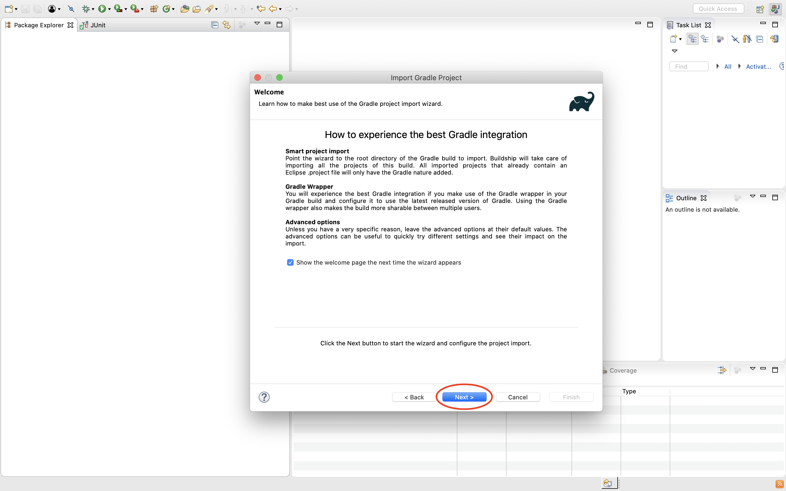
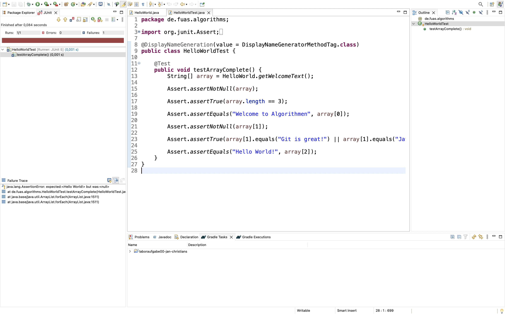
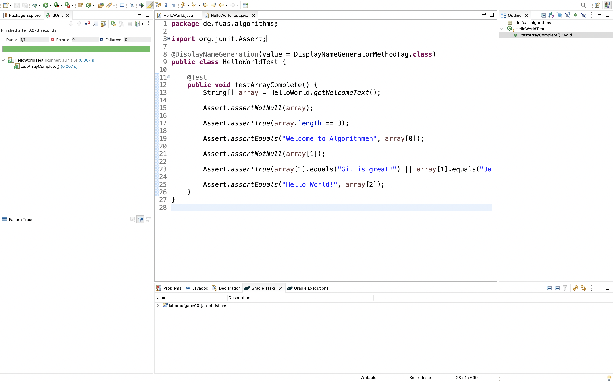
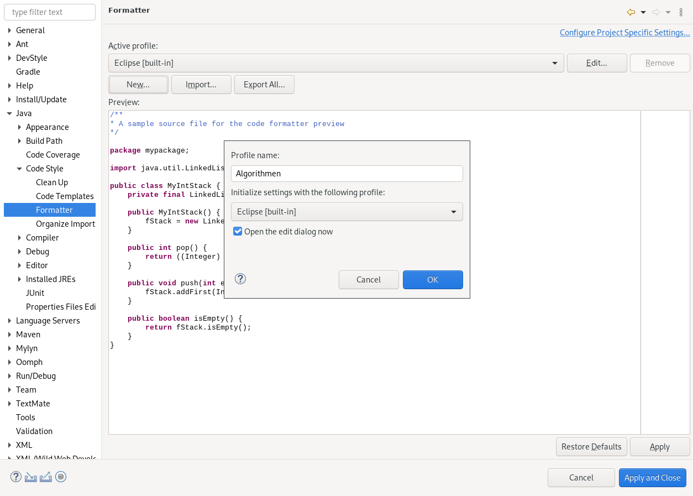

1. [Import eines Projektes](#import-eines-projektes)

2. [Ausführen von JUnit-Testfällen](#ausführen-von-junit-testfällen)

3. [Refactorings](#refactorings)

4. [Einstellungen](#einstellungen)

 

## Import eines Projektes

Für jede Aufgabenserie wird ein GitHub-_Repository_ zur Verfügung gestellt.
Um den darin zur Verfügung gestellten Code zu nutzen, kann er wie folgt in Eclipse importiert werden.
Mit einem Rechtsklick im `Package Explorer` oder über die Menüleiste unter `File` und dann `Datei` den Menüpunkt `Import...` auswählen.

Anschließend wählt ihr die Art in dem das zu importierende Repository vorliegt. In diesem Fall handelt es sich um `Existing Gradle Project.`.

Im nachfolgenden Schritt wählt ihr den Pfad des Ordners für die entsprechende Serie aus.
Der Knopf `Directory...` kann genutzt werden, um das Verzeichnis zu suchen.

Die Bearbeitung der Aufgaben nehmt ihr im Ordner `/src/main/java/` vor.

Wenn die Aufgabenstellung Testfälle zur Verfügung stellt, können diese mit einem klickt der rechten Maustaste und den Menüpunkt `Run As JUnit Test` ausgeführt werden.

  

## Ausführen von _JUnit_-Testfällen

Um die Tests auszuführen, müsst ihr lediglich die Test-Klasse ausführen.

Nach dem Ausführen erhaltet ihr das Testergebnis.
Als Bezeichnung für den Test wird der Methodenname verwendet.
So könnt ihr nachvollziehen, bei welchem Test es vielleicht noch Schwierigkeiten gibt.
In diesem Fall war der Test nicht erfolgreich. (Dies ist zum Einen an dem roten Balken, als auch an dem Icon am Testfall zu erkennen.)
Die Icons an den Testfällen zeigen das Ergebnis für den jeweiligen Test an.
Der obere Balken trifft eine Aussage darüber, ob ALLE Tests erfolgreich waren oder nicht.

Nachdem alle Fehler behoben wurden und die geprüfte Methode alle Testvoraussetzungen erfüllt, ist folgendes zu sehen:
Das Icon am Testfall zeigt, dass der einzelne Test erfolgreich war.
In diesem Beispiel war `testExpandArray` erfolgreich und `testShiftElements` nicht erfolgreich (siehe jeweils Testfall-Icon).
Es waren somit nicht alle Tests erfolgreich - der rote Balken wird angezeigt.

Wenn alle Testfälle erfolgreich waren, wird für jeden Testfall das entsprechende Icon angezeigt und der Balken wir grün angezeigt.

 

## Refactorings

### Umbennen mehrerer Vorkommen eines Variablen-/Methoden-/Klassennamens

Um mehrere Vorkommen eines Variablennamens umbenennen zu können, geht ihr am Besten wie folgt vor:
Zuerst markiert ihr eines der Vorkommen.

Anschließend klickt ihr mit der rechten Maustaste auf den zu ändernden Namen, wählt `Refactor` und `Rename` aus.

Nun ist der Modus zum Umbenennen aktiviert...

... und ihr könnt den bisherigen Namen verändern.

Bestätigt abschließend mit _Enter_ den neuen Namen.

 

## Einstellungen

### Einstellungen des Code-Formatters

Über die Menüleiste unter `Window` den Menüpunkt `Preferences` auswählen.[^macos]

[^macos]: Unter MacOS ist der Menüpunkt `Preferences` im Anwendungsmenü zu finden, also unter dem Menüpunkt `Eclipse`.

Im Einstellungsfenster navigiert ihr zu dem Punkt `Java`, dann `Code Style` und schließlich `Formatter`.

Unter den Einstellungen muss nun ein neues Profil angelegt werden, dazu klickt ihr auf den Button `New...`.

Im Konfigurationsdialog wählt ihr den Profilnamen `Algorithmen` und als Vorgabeprofil `Eclipse [built-in]`. Da das Profil noch bearbeitet werden muss, bleibt die Option `Open the edit dialog now` ausgewählt.

In dem neuen Einstellungsfenster wählt ihr nun den Unterpunkt `Indentation`.

Dort ändert ihr die Einstellung `Tab policy` auf `Spaces only`.

Die Einstellungen können nun verlassen werden, dabei nicht vergessen die Einstellungen mit einem Klick auf `Apply and Close` anzuwenden.
