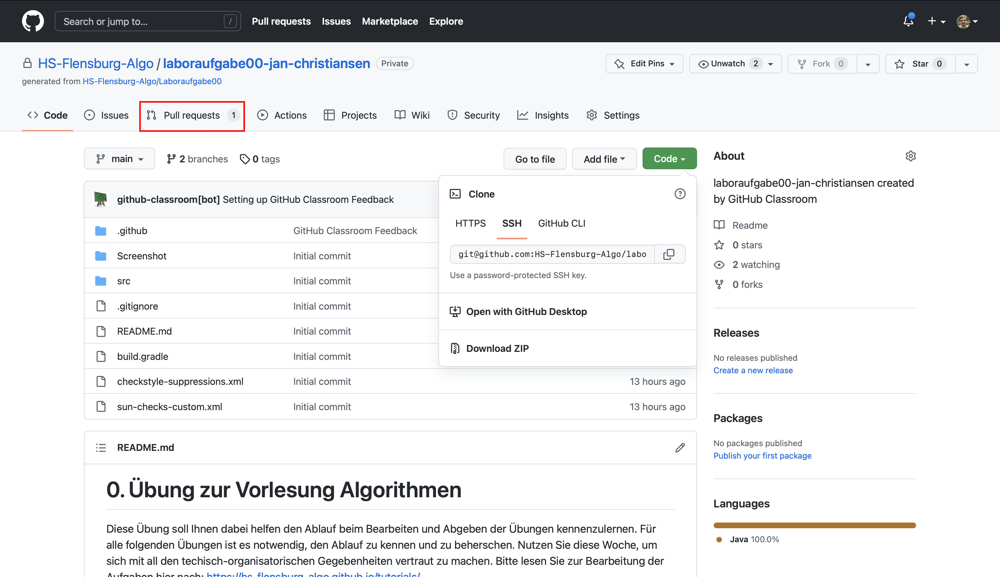
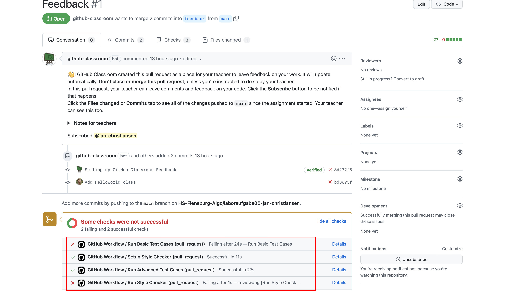
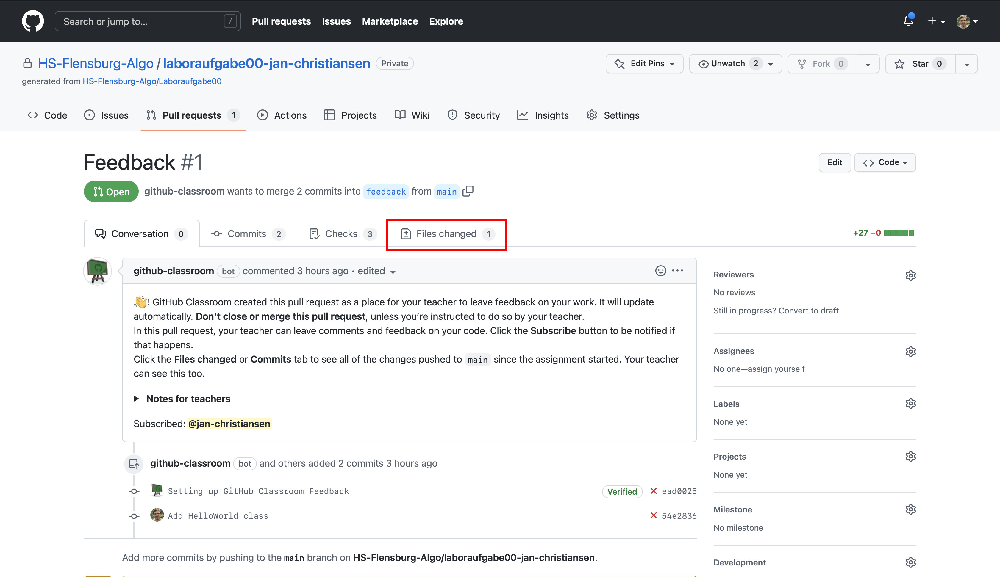
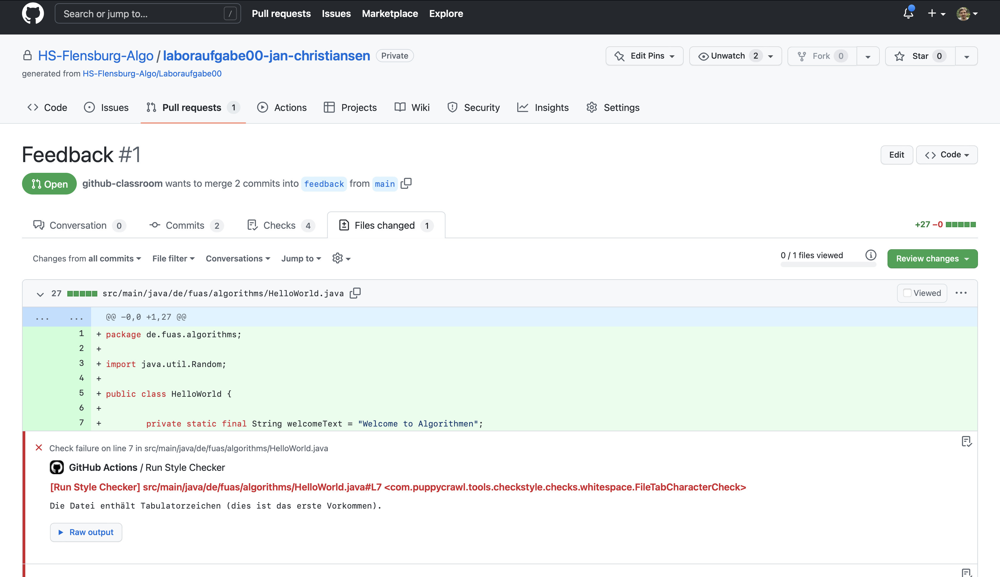
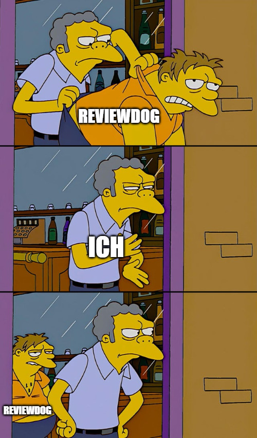
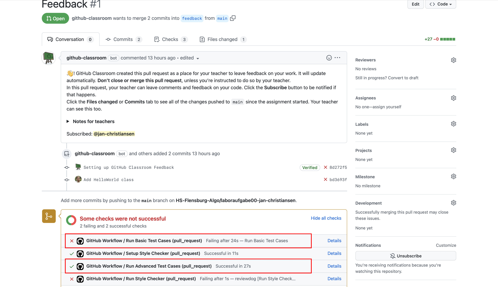
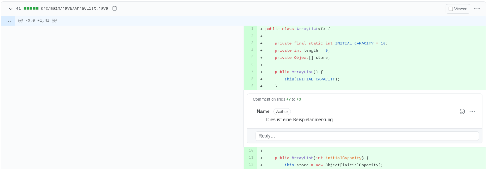

1. [Stil-Anmerkungen des Linters](#stil-anmerkungen-des-linters)

2. [Testfälle](#testfälle)

3. [Manuelle Kommentare](#manuelle-kommentare)

 

Die _Repositories_ mit den Laboraufgaben sind so konfiguriert, dass automatisch geprüft wird, dass ihr euch an bestimmte Programmierregeln haltet und dass die Testfälle alle erfolgreich sind.
Die automatische Überprüfung der Programmierregeln wird mit dem Tool [Checkstyle](https://checkstyle.sourceforge.io) durchgeführt.
Man nennt diese Art eines Tools auch einen Linter.
Ein Tool namens [reviewdog](https://github.com/reviewdog/reviewdog) sorgt dann dafür, dass die Anmerkungen, die Checkstyle hat, an den richtigen Stellen eures Codes bei GitHub angezeigt werden.

Um zu den Anmerkungen der automatischen Checks zu gelangen, müsst ihr zuerst den Reiter _Pull Request_ wählen.

Es sollte dort einen _Pull Request_ geben, der Feedback heißt.
Wählt diesen bitte aus.
Falls dieser _Pull Request_ nicht existiert, nehmt bitte Kontakt zu mir auf.
Das rote Kreuz zeigt an, dass die automatischen Checks noch Fehler gefunden haben:

In dem _Pull Request_ namens Feedback könnt ihr sehen, ob die Checks Fehler gefunden haben.
Dazu müsst ihr auf der Seite etwas runterscrollen.
Die Fehler werden durch ein rotes Kreuz signalisiert.
Es gibt drei verschiedene Checks.

## Stil-Anmerkungen des Linters

Der Style Checker überprüft, dass ihr euch an Grundregeln der Programmierung unter Java haltet und gibt euch ggf. noch Tipps, wie man die Struktur eures Codes verbessern kann.
Der Schritt `Run Style Checker` sollte zum Abgabetermin einen grünen Haken zeigen.
Im _Pull Request_ mit dem Namen _Feedback_, könnt ihr oben den Reiter _Files changed_ auswählen.

Unter _Files changed_ seht ihr alle Änderungen, die ihr an dem Code im _Repositories_ durchgeführt habt.
Dort könnt ihr auch zeilenweise die Anmerkungen des reviewdog sehen.
Die Anmerkung steht jeweils unter der Codezeile, auf die sich die Anmerkung bezieht.

In diesem Fall merkt der reviewdog zum Beispiel an, dass man in Sourcecode die Einrückung des Codes mit Leerzeichen und nicht mit Tabulatoren machen sollte.
Der reviewdog überpüft unter anderem, dass eurer Code eine bestimmte Einrückung nutzt.
Ihr könnt Eclipse so konfigurieren, dass es automatisch die gewünschte Einrückung erzeugt.
Wie könnt ihr unter https://hs-flensburg-algo.github.io/tutorials/eclipse.html#einstellungen lesen.

Zur Abgabe sollte der reviewdog keine Anmerkungen mehr zu eurem Code haben.
Das Umsetzen der Anmerkungen kann durchaus mehrere Iterationen in Anspruch nehmen, wie das folgende Meme eines Studierenden aus einem früheren Semester illustriert.

## Testfälle

Während der Style Checker einige Stilaspekte der Implementierung prüft, prüfen JUnit-Testfälle, ob die geforderten Methoden sich korrekt verhalten.
Dabei reicht es allerdings nicht, sich auf die Testfälle zu verlassen, da Testfälle immer nur endlich viele Beispielwerte testen, während eine Methode ggf. unendlich viele verschiedene Argumente erhalten kann.
Daher ist es trotz der Testfälle wichtig, sich zu überlegen, ob das Verhalten der Methode sinnvoll ist.

Es gibt zwei Gruppen von Testfällen.

Die 

## Manuelle Kommentare

Wenn ihr eine Lösung hochgeladen habt, schaue ich mir die Lösung in der entsprechenden Laborzeit an und schreibe Kommentare.
Diese Kommentare findet ihr ebenfalls unter _Files changed_ des _Pull Requests_.

