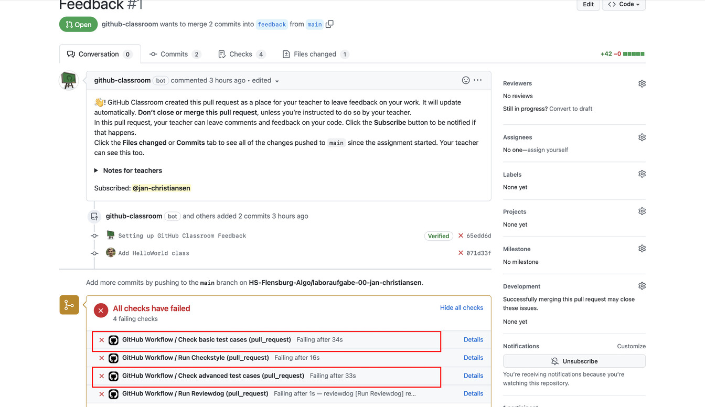
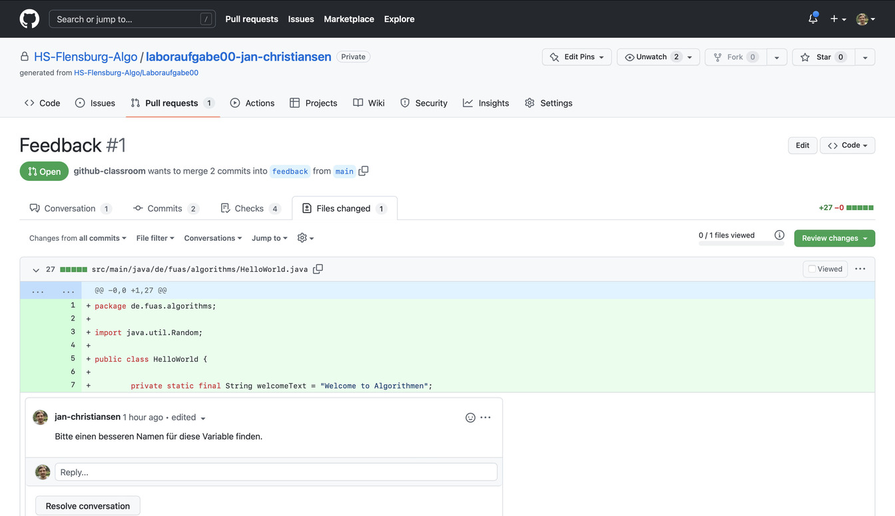

1. [Automatische Checks](#automatische-checks)

2. [Stil-Anmerkungen des Linters](#stil-anmerkungen-des-linters)

3. [Testfälle](#testfälle)

4. [Manuelle Kommentare](#manuelle-kommentare)

 

## Automatische Checks

Die _Repositories_ mit den Laboraufgaben sind so konfiguriert, dass automatisch geprüft wird, dass ihr euch an bestimmte Programmierregeln haltet und dass die Testfälle alle erfolgreich sind.
Die automatische Überprüfung der Programmierregeln wird mit dem Tool [Checkstyle](https://checkstyle.sourceforge.io) durchgeführt.
Man nennt diese Art eines Tools auch einen Linter.
Ein Tool namens [reviewdog](https://github.com/reviewdog/reviewdog) sorgt dann dafür, dass die Anmerkungen, die Checkstyle hat, an den richtigen Stellen eures Codes bei GitHub angezeigt werden.

Um zu den Anmerkungen der automatischen Checks zu gelangen, müsst ihr zuerst den Reiter _Pull Request_ wählen.

Es sollte dort einen _Pull Request_ geben, der Feedback heißt.
Wählt diesen bitte aus.
Falls dieser _Pull Request_ nicht existiert, nehmt bitte Kontakt zu mir auf.
Das rote Kreuz zeigt an, dass die automatischen Checks noch Fehler gefunden haben:

In dem _Pull Request_ namens Feedback könnt ihr sehen, welcher Check Fehler gefunden hat.
Dazu müsst ihr auf der Seite etwas runterscrollen.
Die Fehler werden durch ein rotes Kreuz signalisiert.
Es gibt drei verschiedene Checks.
Im _Pull Request_ werden vier Checks angezeigt, aber der Check `Set Up Style Checker` führt nur eine interne Initialisierung aus und sollte immer erfolgreich sein.

## Stil-Anmerkungen des Linters

Der Style Checker überprüft, dass ihr euch an Grundregeln der Programmierung unter Java haltet bzw. gibt euch Tipps, wie ihr die Struktur eures Codes verbessern könnt.
Der Schritt `Run Style Checker` sollte zum initialen Abgabetermin einen grünen Haken zeigen.
Im _Pull Request_ mit dem Namen _Feedback_, könnt ihr oben den Reiter _Files changed_ auswählen.

Unter _Files changed_ seht ihr alle Änderungen, die ihr an dem Code im _Repositories_ durchgeführt habt.
Dort könnt ihr auch zeilenweise die Anmerkungen des Linters sehen.
Die Anmerkung steht jeweils unter der Codezeile, auf die sich die Anmerkung bezieht.

In diesem Fall merkt der reviewdog zum Beispiel an, dass man im Quellcode die Einrückung des Codes mit Leerzeichen und nicht mit Tabulatoren machen sollte.

Der Linter überprüft unter anderem, dass eurer Code eine bestimmte Einrückung nutzt.
Ihr könnt Eclipse so konfigurieren, dass es automatisch die gewünschte Einrückung erzeugt, wenn ihr den Code automatisch formatiert.
Wie ihr Eclipse konfigurieren könnt, könnt ihr [hier](https://hs-flensburg-algo.github.io/tutorials/eclipse.html#einstellungen) lesen.

Zur Abgabe sollte der Linter keine Anmerkungen mehr zu eurem Code haben.
Das Umsetzen der Anmerkungen kann durchaus mehrere Iterationen in Anspruch nehmen, wie das folgende Meme eines Studierenden aus einem früheren Semester illustriert.

## Testfälle

Während der Style Checker einige Stilaspekte der Implementierung prüft, prüfen JUnit-Testfälle, ob die geforderten Methoden sich korrekt verhalten.
Dabei reicht es allerdings nicht, sich auf die Testfälle zu verlassen, da Testfälle immer nur endlich viele Beispielwerte testen, während eine Methode ggf. unendlich viele mögliche Eingaben hat.
Daher ist es trotz der Testfälle wichtig, sich zu überlegen, ob das Verhalten der Methode sinnvoll ist.

Es gibt zwei Gruppen von Testfällen.

Die `Basic Test Cases` enthalten grundlegende Prüfungen der Funktionalität und sollten schon zum initialen Abgabetermin grün sein.
Die `Advanced Test Cases` testen Verhalten ab, das erfahrungsgemäß etwas schwieriger umzusetzen ist.
Diese Testfälle müssen erst zur Abgabe der Überarbeitung grün sein.

Die Testfälle können einfach in Eclipse ausgeführt werden, sodass die Lösung nicht hochgeladen werden muss, um zu prüfen, ob die Testfälle erfüllt sind.
[Hier](https://hs-flensburg-algo.github.io/tutorials/eclipse.html#ausführen-von-junit-testfällen) wird erläutert, wie man die Testfälle in Eclipse ausführt.

## Manuelle Kommentare

Einige inhaltliche Anmerkungen können nicht durch ein automatisiertes Tool erstellt werden.
Daher schaue ich mir die Abgaben in der Laborzeit an und schreibe Anmerkungen.
Diese Anmerkungen müssen ebenfalls alle bei der Abgabe der überarbeiteten Version abgearbeitet sein.
Diese Kommentare findet ihr ebenfalls unter _Files changed_ des _Pull Requests_.

Die von mir geschriebenen Anmerkungen könnt ihr auch auf der Übersichtsseite des _Pull Requests_ sehen.
Ich markiere beim Schreiben der Anmerkungen die Codezeilen, auf die sich der Kommentar bezieht.
Diese Codezeilen könnt ihr oberhalb des Kommentars sehen.

Ein Kommentar bezieht sich immer auf die Codezeilen am unteren Ende des Ausschnitts.
In diesem Fall bezieht sich der Kommentar zum Beispiel auf die Zeile 7.
GitHub zeigt bei einem solchen Kommentar immer mindestens vier Zeilen an, auch wenn sich der Kommentar nur auf eine Zeile bezieht.
Dies führt manchmal zu Missverständnissen, auf welchen Teil des Codes sich ein Kommentar bezieht.

Wenn ein Kommentar aus meiner Sicht abgearbeitet ist, wird er von mir als _Resolved_ markiert.
Wenn alle Kommentare als _Resolved_ markiert sind und die Checks alle grün sind, wird der _Pull Request_ geschlossen.