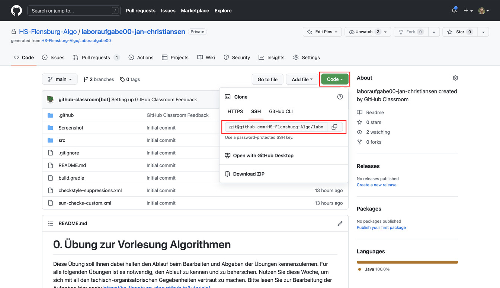

1. [Installation von Git unter Windows](#installation-von-git-unter-windows)

2. [Konfiguration des Nutzers](#konfiguration-des-nutzers)

3. [Git über die Konsole bedienen](#git-über-die-konsole-bedienen)

4. [Commit-Nachrichten schreiben](#commit-nachrichten-schreiben)

<br/>

## Installation von Git unter Windows

Unter <https://git-scm.com/download/win> findet ihr den _Installer_. Der Download sollte automatisch starten.

Im Installationsprozess muss nur eine Sache verändert werden.

Im 1. Schritt `Select Components` sollte die `Windows Explorer integration` mit `Git Bash Here` ausgewählt sein. Dies ist standardmäßig der Fall.

Im 2. Schritt `Choosing the default editor used by Git` sollte ein anderer Editor als Vim benutzt werden.

Ihr könnt entweder euren Lieblingseditor aus der Liste auswählen oder den Punkt `Select other editor as Git's default editor`. Als `Location of editor` tragt ihr dann euren Editor ein, oder einfach `C:\Windows\notepad.exe` für den Editor von Windows.

Ab da kann den Standardeinstellungen gefolgt werden, am Ende auf `Install` klicken.

Nach der erfolgreichen Installation nur noch kurz das Häkchen bei `View Release Notes` entfernen und mit `Next` den _Installer_ beenden.

Nun öffnet ihr mit dem Windows Explorer den Ordner, in dem ihr die Bearbeitung der Aufgaben vornehmen wollt.

Mit einem Rechtsklick in dem Ordner könnt ihr nun im Kontextmenü `Git Bash Here` auswählen, es öffnet sich ein Konsolenfenster.

**Hinweise:**
- Die `Git Bash` nutzt die Tastenkombination `Strg + Einfg` für Kopieren und `Umschalt + Einfg` für Einfügen statt der üblichen `Strg + C` für Kopieren und `Strg + V` für Einfügen.
- Die `Git Bash` unterstützt Autovervollständigung für Dateien, das heißt, statt den gesamten Pfad anzugeben, könnt ihr den Pfad starten und dann `Tab` drücken, damit der Pfad vervollständigt wird.

<br/>

## Konfiguration des Nutzers

Damit GitHub euch die Commits, die ihr durchführt, zuordnen kann, solltet ihr einmal euren Namen und eure Mail-Adresse setzen.
Dazu müsst ihr in der Konsole die folgenden beiden Befehle eingeben und jeweils mit der _Eingabe_-Taste bestätigen.
Ihr müsst dabei meinen Namen und meine E-Mail-Adresse natürlich durch eure jeweiligen Informationen ersetzen.
Ihr solltet eine E-Mail-Adresse nutzen, die ihr auch bei GitHub eingetragen habt.
Bitte beachtet, dass die E-Mail-Adresse von Personen eingesehen werden kann, die Zugriff auf eines eurer _Repositories_ haben.

```shell
$ git config --global user.name "Jan Christiansen"
```

```shell
$ git config --global user.email "jan.christiansen@hs-flensburg.de"
```

Unter [diesem Link](https://docs.github.com/en/free-pro-team@latest/github/setting-up-and-managing-your-github-user-account/setting-your-commit-email-address#setting-your-commit-email-address-in-git) findet ihr bei Interesse noch eine alternative Erklärung und zusätzliche Informationen zu dieser Konfiguration und GitHub.

<br/>

## Git über die Konsole bedienen

Zum Bearbeiten und zur Abgabe der Aufgaben müsst ihr den über GitHub bereitgestellten Source-Code über die Konsole verwalten.  

### Repository klonen

Damit ihr den Code lokal bearbeiten könnt, müsst ihr das Repo klonen. Ihr benötigt dafür zunächst einen _SSH Key_. Diesen müsst ihr zu eurem GitHub-Account hinzufügen. Eine ausführliche Erklärung zur Generierung eines _SSH Keys_ und dem Hinzufügen des _SSH Keys_ zu eurem GitHub-Account findet ihr [hier](https://docs.github.com/en/github/authenticating-to-github/connecting-to-github-with-ssh).

Anschließend benötigt ihr die URL eures _Repos_.
Diese erhaltet ihr auf der GitHub-Webseite:



Mithilfe der URL könnt ihr das _Repository_ über eure Konsole mit `git clone <url>` herunterladen.
Sofern ihr bei der Generierung des _SSH Keys_ eine _Passphrase_ festgelegt habt, müsst ihr diese nun eingeben.

```shell
$ git clone git@github.com:HS-Flensburg-Algo/laboraufgabe00-jan-christiansen.git
```

Anschließend wechselt ihr in das heruntergeladene _Repository_ mit `cd <repo-name>`.

```shell
$ cd laboraufgabe00-jan-christiansen
```

### Bearbeitete Dateien hochladen

Nachdem ihr die Aufgabe bearbeitet habt, könnt ihr mit `git status` alle editierten Dateien sehen.

```shell
$ git status
On branch master
Your branch is up to data with `origin/master`.

Changes not staged for commit:
  (use "git add <file>..." to update what will be committed)
  (use "git checkout -- <file>..." to discard changes in working directory)

       modified:   src/main/java/de/fuas/algorithms/HelloWorld.java

no changes added to commit (use "git add" and/or "git commit -a")
```

Die Dateien, die ihr abgeben wollt, müssen nun jeweils mit `git add <file-path>` selektiert werden.

```shell
$ git add src/main/java/de/fuas/algorithms/HelloWorld.java
```

**Hinweise:**
- Ihr könnt auch mehrere Dateien auf einmal hinzufügen, indem ihr die Dateipfade durch Leerzeichen getrennt auflistet, also zum Beispiel `git add <filepath1> <filepath2>`.


Zum Überprüfen, ob alle abzugebenden Dateien ausgewählt/hinzugefügt wurden, kann erneut `git status` aufgerufen werden.
Alle in grün geschriebenen Dateien wurden zur Abgabe selektiert.

```shell
$ git status
On branch master
Your branch is up to data with `origin/master`.

Changes to be committed:
  (use "git reset HEAD <file>..." to unstage)

       modified:    src/main/java/de/fuas/algorithms/HelloWorld.java
```

Vor dem Upload müssen die Dateien "committet" werden.
Einen _Commit_ führt man mit dem Kommando `git commit -m "<commit-message>"` durch.
Der Text `<commit-message>` ist dabei eine Beschreibung der Arbeiten, die ihr durchgeführt habt und die ihr mit dem _Commit_ bei GitHub hochladen wollt.

```shell
$ git commit -m "Change ..."
[master 7d612e] Change ...
 1 file changed, 1 deletion(-)
```

Die Abgabe / der Upload der Bearbeitung erfolgt zu guter Letzt mit `git push`.
Mit dem Befehl `git push` werden alle _Commits_, die ihr seit dem letzten `git push` durchgeführt habt, hochgeladen.

```shell
$ git push
Enumerating objects: 7, done.
Counting objects: 100% (7/7), done.
Delta compresiosn using up to 4 threads
Compressing objects: 100% (4/4), done.
Writing objects: 100% (4/4), 366 bytes | 366.00 KiB/s, done.
Total 4 (delta 2), reused 0 (delta 0)
remote: Resolving deltas: 100% (2/2), completed with 2 local objects.
To https://github.com:HS-Flensburg-Algo/laboraufgabe00-jan-christiansen.git
   f82bb14..d079b90  main -> main
```

### Mögliche Probleme

Es kann vorkommen, dass der Befehl `git push` nicht erfolgreich ist und ihr zum Beispiel eine Fehlermeldung der folgenden Art erhaltet.

```
To github.com:HS-Flensburg-Algo/laboraufgabe00-jan-christiansen.git
 ! [rejected]        main -> main (fetch first)
error: failed to push some refs to 'git@github.com:HS-Flensburg-Algo/laboraufgabe00-jan-christiansen.git'
hint: Updates were rejected because the remote contains work that you do
hint: not have locally. This is usually caused by another repository pushing
hint: to the same ref. You may want to first integrate the remote changes
hint: (e.g., 'git pull ...') before pushing again.
hint: See the 'Note about fast-forwards' in 'git push --help' for details.
```

Dies passiert zum Beispiel, wenn ihr parallel mithilfe des Web-Interface von GitHub Dateien hochgeladen oder Dateien verändert habt.
Um dieses Problem zu beheben, müsst ihr einmal die Änderungen, die im Repo passiert sind, zu euch auf den Rechner holen.
Dazu müsst ihr den Befehl `git pull` ausführen.
Nach Ausführung des Befehls sollte sich ein Editor öffnen.
Den Editor könnt ihr einfach schließen und die Datei speichern.
Danach sollte eine Nachricht der folgenden Art erscheinen.

```
remote: Enumerating objects: 13, done.
remote: Counting objects: 100% (13/13), done.
remote: Compressing objects: 100% (9/9), done.
remote: Total 10 (delta 3), reused 0 (delta 0), pack-reused 0
Unpacking objects: 100% (10/10), done.
From github.com:HS-Flensburg-Algo/laboraufgabe00-jan-christiansen
   a7a5355..e6dd480  master     -> origin/master
Merge made by the 'recursive' strategy.
 .github/classroom/autograding.json | 14 ++++++++++++++
 .github/workflows/classroom.yml    | 11 +++++++++++
 2 files changed, 25 insertions(+)
 create mode 100644 .github/classroom/autograding.json
 create mode 100644 .github/workflows/classroom.yml
```

Jetzt solltet ihr ganz normal mit dem Befehl `git push` fortfahren können.

<br/>


## Commit-Nachrichten schreiben

Wenn man professionell Software entwickelt, sollte man sich etwas Mühe mit den _Commit_-Nachrichten geben.
Wie in vielen anderen Bereichen der Informatik sollten die Nachrichten zumindest erst einmal einheitlich sein.
Ihr sollt euch im Zuge der Veranstaltung gern so gut es geht an die Vorschläge unter [How to Write a Git Commit Message](https://cbea.ms/git-commit/) halten.
Aufgrund der recht kleinen Projekte, die im Rahmen der Vorlesung programmiert werden, reicht es, wenn eure _Commit_-Nachrichten nur aus einem _Subject_ bestehen.
Das heißt, mögliche Nachrichten wären zum Beispiel `Add first implementation of ArrayList`, `Fix size method` oder `Rename class to ArrayList`. 

