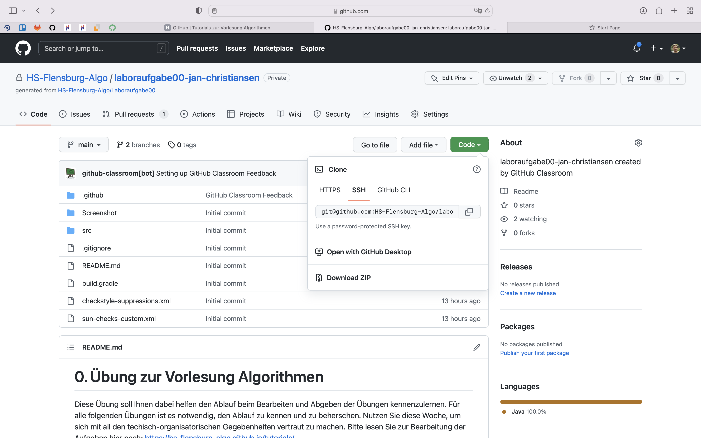
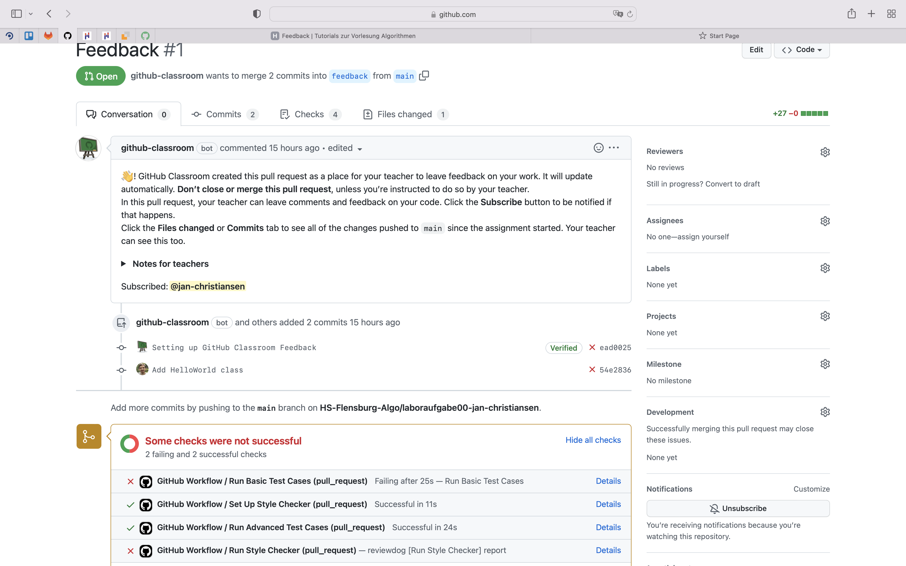

[Zurück](index.md)

# GitHub

[GitHub über die Konsole bedienen](#github-über-die-konsole-bedienen)

[Feedback und reviewdog](#feedback-und-reviewdog)

<br/>

# GitHub über die Konsole bedienen

## Installation von Git unter Windows

Unter https://git-scm.com/download/win findet ihr den Installer. Der Download sollte automatisch starten.

Im Installationsprozess muss nur eine Sache verändert werden.

Im 1. Schritt `Select Components` sollte die `Windows Explorer integration` mit `Git Bash Here` ausgewählt sein. Dies ist standardmäßig der Fall.

Im 2. Schritt `Choosing the default editor used by Git` sollte ein anderer Editor als Vim benutzt werden.

Ihr könnt entweder euren Lieblingseditor aus der liste auswählen oder den Punkt `Select other editor as Git's default editor`. Als `Location of editor` tragt ihr dann euren Editor ein, oder einfach `C:\Windows\notepad.exe` für den Editor von Windows.

Ab da kann den Standardeinstellungen gefolgt werden, am Ende auf `Install` klicken.

Nach der erfolgreichen Installation nur noch kurz das Häkchen bei `View Release Notes` entfernen und mit `Next` den Installer beenden.

Nun öffnet ihr den Ordner, in dem ihr die Bearbeitung der Aufgaben vornehmen wollt, mit dem Windows Explorer.

Mit einem Rechtsklick in dem Ordner könnt ihr nun im Kontextmenü `Git Bash Here` auswählen, es öffnet sich ein Konsolenfenster.

<br/>


## Konfiguration des Nutzers

Damit Git euch die Commits, die ihr durchführt, zuordnen kann, solltet ihr einmal euren Namen und eure Mail-Adresse setzen.
Dazu müsst ihr in der Konsole die folgenden beiden Befehle eingeben und jeweils mit der _Eingabe_-Taste bestätigen.
Ihr müsst dabei meinen Namen und meine E-Mail-Adresse natürlich durch eure jeweiligen Informationen ersetzen.

```
git config --global user.name "Jan Christiansen"
```

```
git config --global user.email "jan.christiansen@hs-flensburg.de"
```

Unter [diesem Link](https://docs.github.com/en/free-pro-team@latest/github/setting-up-and-managing-your-github-user-account/setting-your-commit-email-address#setting-your-commit-email-address-in-git) findet ihr bei Interesse noch eine alternative Erklärung und zusätzliche Informationen zu diesen Informationen und GitHub.

<br/>


## Git über die Konsole bedienen

Zum Bearbeiten und zur Abgabe der Aufgaben müsst ihr den über GitHub bereitgestellten Source-Code über die Konsole verwalten.  

Damit ihr den Code lokal bearbeiten könnt, benötigt ihr die URL eures Repos. Diese erhaltet ihr auf der GitHub-Webseite:


Mit Hilfe der URL könnt ihr das Repository über eure Konsole mit `git clone <url>` herunterladen.


Anschließend wechselt ihr in das heruntergeladene Repository mit `cd <repo-name>`.


Nachdem ihr die Aufgabe bearbeitet habt, könnt ihr mit `git status` alle editierten Dateien sehen.


Die Dateien, die ihr abgeben wollt, müssen nun jeweils mit `git add <file-path>` selektiert werden.


Zum Überprüfen, ob alle abzugebenen Dateien ausgewählt/hinzugefügt wurden, kann erneut `git status` aufgerufen werden.
Alle in grün geschriebenen Dateien wurden zur Abgabe selektiert.


Vor dem Upload müssen die Dateien "committed" werden - `git commit -m "<commit-message>"`.


Die Abgabe / Der Upload der Bearbeitung erfolgt zu guter Letzt mit `git push`.


  <br/>

# Feedback und reviewdog

## Anmerkungen lesen

GitHub ist so konfiguriert, dass automatisch geprüft wird, dass ihr euch an bestimmte Programmierregeln halten müsst. Diese automatische Überprüfung wird reviewdog genannt.

Diese Anmerkungen findet ihr im Feedback Pull-Request.



Nun solltet sich diese Seite öffnen. Das rote Kreuz zeigt an, dass noch Fehler gefunden wurden:


Wenn ihr den Feedback-Pull Request gewählt habt, könnt ihr oben den Reiter "Files changed" auswählen.



Ihr seht dann zeilenweise Anmerkungen an eurer Abgabe.


Wenn ihr eine Lösung hochgeladen habt, schaue ich mir die Lösung in der entsprechenden Laborzeit an und schreibe Kommentare. Diese Kommentare findet ihr ebenfalls dort.


