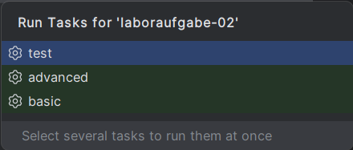
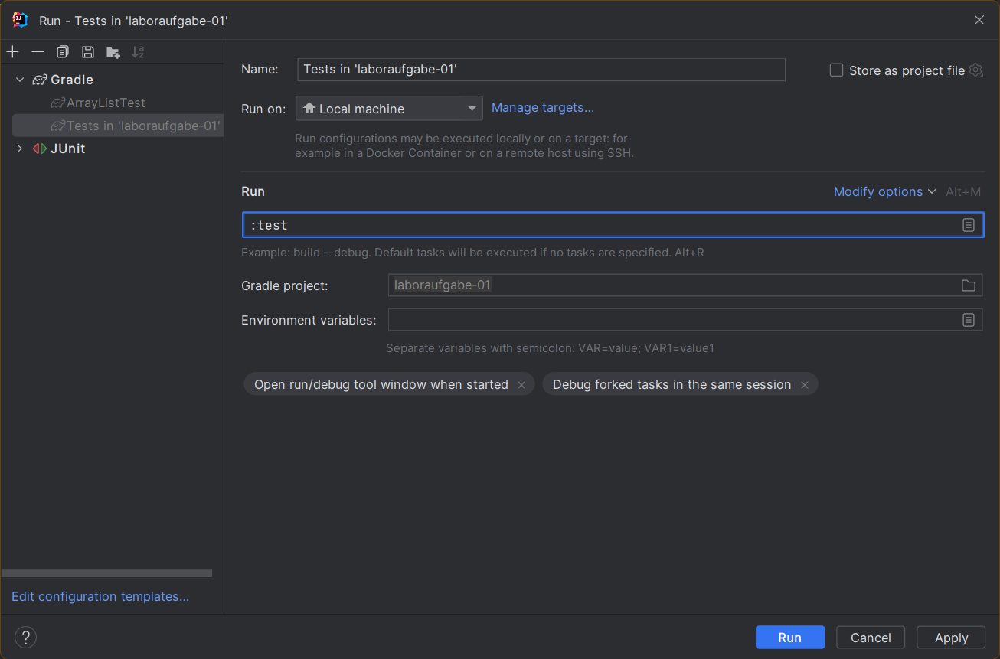
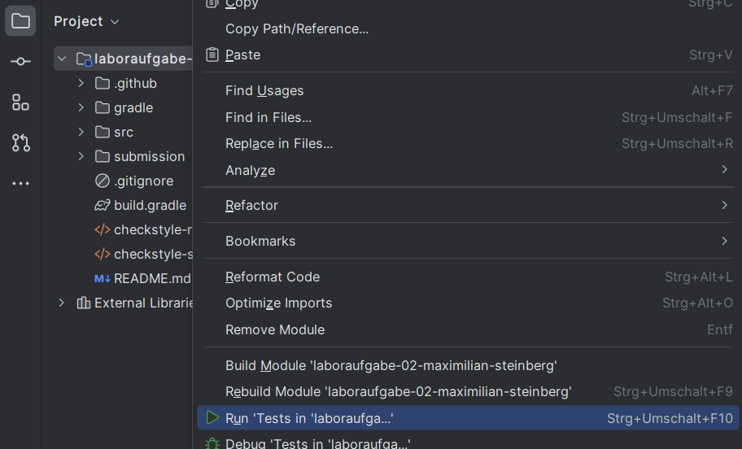
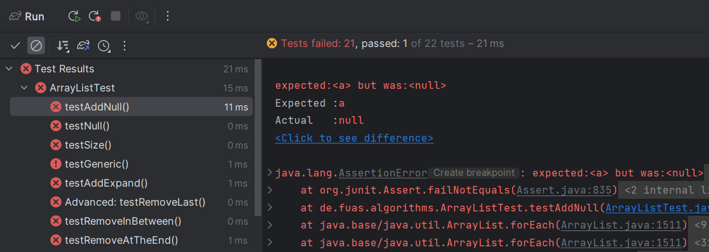
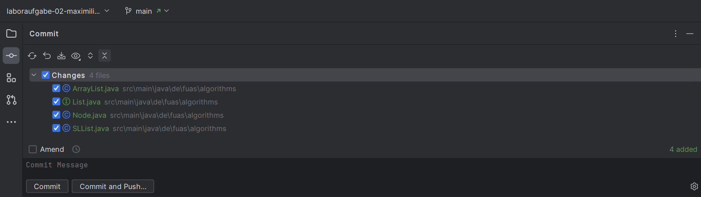
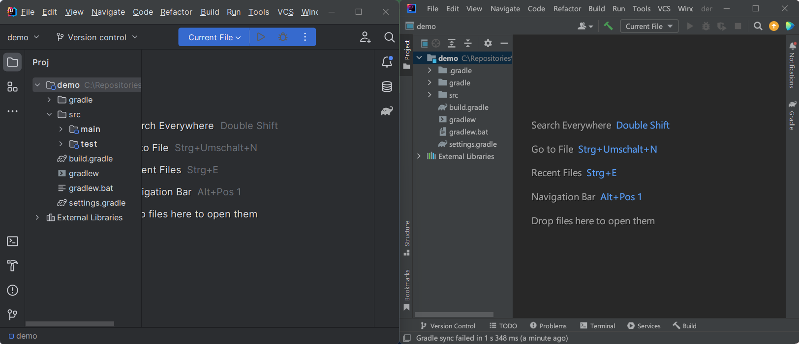

1. [Übersicht](#übersicht)

2. [Benutzererstellung und Aktivierung](#benutzererstellung-und-Aktivierung)

3. [Import eines Projekts](#import-eines-projekts)

4. [JUnit-Testfälle](#junit-testfälle)

5. [Git-Integration](#git-integration)

6. [Einstellungen](#einstellungen)

 

## Übersicht
Für die Bearbeitung der Laboraufgaben können Sie neben Eclipse auch auf die Entwicklungsumgebung [IntelliJ](https://www.jetbrains.com/de-de/idea/) des Unternehmens JetBrains zurückgreifen.

### Versionierung
IntelliJ wird in zwei Versionen angeboten:

- Community
- Ultimate

Beide Versionen können im vollen Umfang für die Bearbeitung der Laboraufgaben genutzt werden.
Eine Auflistung der Unterschiede finden Sie [hier](https://www.jetbrains.com/de-de/idea/).
Im Wesentlichen beziehen sich diese auf die Unterstützung weiterer Sprachen, Datenbanken und bekannter Frameworks.

Wenn Sie planen IntelliJ ausschließlich für diese Veranstaltung zu nutzen, empfiehlt sich die Community-Version.
Diese steht grundsätzlich kostenlos zur Verfügung und kann ohne Registrierung genutzt werden. 

Wollen Sie JetBrains-Produkte im vollen Umfang testen und auch in anderen Kursen verwenden, empfiehlt sich die Ultimate-Version. 
Diese wird zwar regulär entgeltlich angeboten, steht Ihnen als Studierende jedoch auch kostenlos für die Dauer Ihres Studiums zur Verfügung. 

Beide Versionen lassen sich von der [Produktseite](https://www.jetbrains.com/de-de/idea/) herunterladen.
Sollten Sie sich für die Ultimate-Version entscheiden, ist eine Registrierung und Bestätigung Ihres Studierendenstatus erforderlich. 
Folgen Sie dazu den entsprechenden Anweisungen im Abschnitt [Benutzererstellung und Aktivierung](#benutzererstellung-und-Aktivierung). 

## Benutzererstellung und Aktivierung
*Dieser Abschnitt ist nur relevant, wenn Sie die Ultimate-Version nutzen möchten.*

Um die Ultimate-Version nutzen zu können, benötigen Sie einen JetBrains-Account und müssen diesen mit Ihrem Studierendenstatus verknüpfen.
Die Verknüpfung findet dabei über GitHub statt.

1. Öffnen Sie [GitHub](https://github.com/) und melden Sie sich mit Ihrem Account an.
2. Öffnen Sie Ihre Profileinstellungen und navigieren Sie zu `Emails`.
3. Fügen Sie hier ihre Email-Adresse der Hochschule Flensburg hinzu (endet auf @stud.hs-flensburg.de).
4. Anschließend bekommen Sie von GitHub eine Bestätigungs-Email zugeschickt. Öffnen Sie diese und klicken Sie auf `Confirm email address`.
5. Öffnen Sie GitHubs [Studierendenportal](https://education.github.com/) und melden Sie sich mit Ihrem GitHub-Account an.
6. Klicken Sie auf `Join Global Campus` und anschließend auf `Yes, I'm a student`. 
7. Wählen Sie in dem untenstehenden Formular Ihre Hochschul-Email-Adresse aus, schreiben Sie einen kurzen Text in das folgende Textfeld und klicken Sie auf `Continue`.
8. Fügen Sie ein Bild Ihrer Studierendenbescheinigung bei und klicken Sie auf `Process my application`.
    - Die Verifizierung durch GitHub dauert in der Regel nur wenige Minuten.
9. Öffnen Sie nun JetBrains [Studierendenportal](https://www.jetbrains.com/shop/eform/students).
10. Klicken Sie auf `GitHub` und anschließend auf `Mit GitHub autorisieren`.
11. Melden Sie sich mit Ihrem GitHub-Account an und klicken Sie auf `Authorize`.
12. Folgen Sie den Anweisungen des Formulars und klicken Sie auf `Kostenlose Produkte beantragen`
13. Über die [Lizenzverwaltung](https://account.jetbrains.com/licenses) können Sie nun Ihr `JetBrains Product Pack for Students` aktivieren und alle Produkte von JetBrains herunterladen.

## Import eines Projekts
Den Import eines Projekts von GitHub können Sie entweder manuell vornehmen oder über die GitHub-Integration in IntelliJ durchführen.

### Manuell
1. Clonen Sie das Projekt in einen beliebigen Ordner auf Ihrem Rechner.
2. Öffnen Sie IntelliJ und wählen Sie `File > New > Project from Existing Sources...`.
3. An dieser Stelle kann ein "Import Project"-Dialog auftreten. Wählen Sie `Create project from existing sources` und bestätigen Sie mit `Next`.
4. Navigieren Sie zu dem Ordner, in dem Sie das Projekt abgelegt haben, und wählen Sie diesen aus.
5. Klicken Sie auf `Ok`.

### GitHub Integration
Einmalig: Navigieren Sie in IntelliJ zu `File > Settings > Version Control > GitHub` und setzen Sie den Haken bei `Clone git repositories using ssh`.
1. Öffnen Sie IntelliJ und wählen Sie `File > New > Project from Version Control...`.
2. Wählen Sie `Repository URL` aus und fügen Sie unter `URL` den SSH-Clone-Link des Repositories ein.
   - Über das Feld `Directory` können Sie den Zielordner angeben, in dem das Projekt abgelegt werden soll.
3. Klicken Sie auf `Clone` und anschließend auf `Trust Project`.

### Hinweis
Wenn Sie Ihr Projekt zuvor in Eclipse gestartet haben, kann es beim Import zu einem Konflikt mit der Import-Konfiguration kommen. 
In einem Dialog müssen Sie auswählen, wie sie das Projekt öffnen möchten.
Klicken Sie hier auf `Gradle project` und bestätigen Sie den Dialog mit `OK`. 

## JUnit Testfälle
### Ausführen
Wenn die Aufgabenstellung Testfälle zur Verfügung stellt, können diese mit einem Rechtsklick auf das Projekt und Auswahl des Menüpunkts `Run 'Tests in '[Name]''` ausgeführt werden. 
Alternativ kann auch der Kurzbefehl `Ctrl + Shift + F10` verwendet werden.
Beim erstmaligen Ausführen der Tests werden Sie über einen Dialog gefragt, welche Tests Sie ausführen möchten. 
Häufig stellt Ihnen die Aufgabe `basic` und `advanced` Testfälle bereit. 
Wählen Sie an dieser Stelle unbedingt `test` aus, um alle Tests auszuführen. 

### Testeinstellungen anpassen
Sollten Sie beim Ausführen der Testfälle `basic` oder `advanced` gewählt haben, müssen Sie die Test-Konfiguration womöglich anpassen, um auch die übrigen Tests ausführen zu können. 

1. Klicken Sie im Menüband auf `Run > Edit Configurations...`.
2. Klappen Sie in der linken Seite des geöffneten Dialogs `Gradle` auf und klicken Sie auf `Tests in 'Laboraufgabe ...'`.
3. Ändern Sie den Inhalt des Felds `Run` entsprechend des folgenden Screenshots zu `:test`. 

### Ablauf

Nach Durchlaufen der Tests öffnet sich im unteren Bereich des Fensters ein Dialog, der Ihnen die Ergebnisse der Tests anzeigt.

Sie sehen hier in welcher Klasse der Test fehlgeschlagen ist, welche Methode fehlgeschlagen ist und warum.

## Git Integration
IntelliJ erkennt automatisch, ob es sich bei dem geöffnetem Projekt um ein Git Repository handelt und bietet Ihnen entsprechende Funktionen an. 
Darunter fallen unter anderem die Verwaltung von Commits, Branches und Tags. 

Die Commitverwaltung können Sie über die Seitenleiste oder alternativ über das Tastenkürzen `ALT + 0` aufrufen.

Der obige Screenshot zeigt die geöffnete Commit-Ansicht. 
Hier können Sie eine Dateiauswahl treffen, eine Commit Message schreiben und beides über `Commit` in den lokalen Branch committen oder über `Commit and Push` direkt in den Remote-Branch pushen.

Weitere Git-Funktionen, etwa zum nachträglichen pushen, können Sie über `Git` im Menüband aufrufen.

## Einstellungen
### Design
IntelliJ startete mit der Version 2022.3 den Umstieg auf ein neues Design, welches in kommenden Updates als Standard festgelegt werden wird. 
Einen Vergleich können Sie dem folgenden Screenshot entnehmen, wobei links das neue und rechts das alte Design zu sehen ist. 

Welches Design sie verwenden, bleibt Ihnen überlassen, die Einstellungen finden Sie unter `File > Settings > Appearance & Behavior > New UI`.