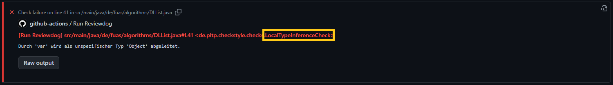

1. [Name einer Regel](#name-einer-regel)

2. [Regeln](#regeln)

    1. [`AvoidLoopBreak`](#avoidloopbreak)

    2. [`FinalParameters`](#finalparameters)

    3. [`LocalTypeInference`](#localtypeinference)

    4. [`PreferExpressions`](#preferexpressions)

    5. [`ReduceScope`](#reducescope)

    6. [`ThisConsistency`](#thisconsistency)

    7. [`VariableDeclarationUsageDistance`](#variabledeclarationusagedistance)


<br/>

## Name einer Regel

 
Die Stil-Anmerkungen des Linters beinhalten neben der kurzen Beschreibung auch Informationen darüber, in welcher Datei der Verstoß gefunden wurde, und vor allem, gegen welche Regel verstoßen wurde.
Im Folgenden gibt es eine Auflistung einiger Regeln, die in den Laboren zum Einsatz kommen.


## Regeln

Bei Programmierregeln gibt es keine Kategorien wie richtig und falsch.
Man kann auch gute Programme schreiben, die sich nicht an die folgenden Regeln halten.
Außerdem hängt die Lesbarkeit von Programmen auch sehr von der Erfahrung der Lesenden ab.
Viele dieser Regeln sorgen aber dafür, dass die Programme eine einfachere Struktur erhalten.
Am Ende sollen die Regeln auch dafür sorgen, dass Programmierer*innen sich bewusst werden, dass es verschiedene Möglichkeiten gibt, ein Programm zu schreiben und man beim Programmieren reflektieren sollte, welche der Möglichkeiten am besten geeignet ist, um ein gut lesbares und wartbares Programm zu schreiben.
Grundsätzlich sollte man immer Konsistenz anstreben.
Das heißt, wenn es zweimal eine ähnliche Methode gibt, sollten diese auch ähnlich implementiert sein.
Wenn man dagegen bei einer der Methoden eine andere Implementierung wählt, erwarten Lesende, dass dieser Unterschied einen inhaltlichen Grund hat.


### `AvoidLoopBreak`

Diese Regel verbietet die Verwendung von `return` und `break` zum Beenden einer Schleife.
Hier soll kurz dargestellt werden, warum diese Konstrukte verboten werden.
Dazu betrachten wir eine Methode, die in einem Array einen Wert sucht.
Wir starten mit einer Implementierung, die `return` nutzt.

```java
static boolean contains1(int[] array, int v) {
    for (int i = 0; i < array.length; i++) {
        if (array[i] == v) {
            return true;
        }
    }
    return false;
}
```

Die Verwendung von `return` sorgt dafür, dass man eine Code-Zeile nicht mehr getrennt betrachten kann, sondern immer den Kontext benötigt, in dem sie verwendet wird.
Wenn man ein Programm der folgenden Form liest, wobei `stmt` eine beliebige Anweisung ist, würde man erwarten, dass dieses Programm `stmt` ausführt und dann `false` zurückliefert.

```java
stmt
return false;
```

Dies in der Methode `contains1` aber nicht der Fall.
Die Anweisung `return false` wird hier nur ausgeführt, falls die Schleife nicht zuvor die Methode verlassen hat.
Anders ausgedrückt wird der Code, der ggf. nach einer Schleife folgt, nicht immer ausführt.
Diese Eigenschaft ist relativ fehleranfällig, da man sie nur an dem `return`, das irgendwo in der Schleife vorkommt, identifizieren kann.

Aus dieser Argumentation folgt, dass die folgende Implementierung in einer imperativen Sprache zu bevorzugen ist.

```java
static boolean contains2(int[] array, int v) {
    boolean found = false;
    for (int i = 0; i < array.length; i++) {
        if (array[i] == v) {
            found = true;
            break;
        }
    }
    return found;
}
```

Nehmen wir zum Beispiel einmal an, wir wollen ein Refactoring durchführen und die Methode zu einer Methode `notContains` abändern.
In der Variante `contains2` reicht es aus, die Zeile `return found` durch `return !found` zu ersetzen.
Bei der Variante `contains1` reicht es aber keineswegs aus, die Zeile `return false` durch `return true` zu ersetzen, wie man in einer komplexen Methode vielleicht erwarten würde.

Um die Variante mit `break` zu implementieren, benötigt man eine zusätzliche boolesche Variable, die das Ergebnis der Schleife an die Anweisung nach der Schleife weiterreicht.
Da wir diese Variable in der verbesserten Variante auf jeden Fall benötigen, können wir auch gleich die folgende Implementierung nutzen.

```java
static boolean contains3(int[] array, int v) {
    boolean found = false;
    for (int i = 0; i < array.length && !found; i++) {
        if (array[i] == v) {
            found = true;
        }
    }
    return found;
}
```

Bei dieser Implementierung sehen wir in der Schleifenbedingung bereits, wann die Schleife beendet wird.
Das heißt, wir müssen nicht mehr in den Code des Schleifenrumpfes schauen, wann die Schleife abbricht, sondern können diese Information an der Stelle ablesen, an der wir sie auch erwarten würden, im Schleifenkopf.

Anders ausgedrückt, würde man normalerweise auch nicht auf die Idee kommen, die folgende Implementierung zu nutzen.

```java
static boolean contains4(int[] array, int v) {
   for (int i = 0;; i++) {
      if (i >= array.length) {
         return false;
      }
      if (array[i] == v) {
         return true;
      }
    }
    return false;
}
```

Hier wird die Abbruchbedingung der Schleife gar nicht mehr im Schleifenkopf definiert sondern lediglich im Code des Rumpfes.
Bei dieser Variante muss man bei komplexeren Methode ggf. viel Code danach überprüfen, ob ein `return` verwendet wird, um den restlichen Code zu verstehen.


### `FinalParameters`

Diese Regel prüft, dass Parameter von Methoden und Konstruktoren als [`final`](http://hs-flensburg-algo.github.io/basics.html#final) deklariert sind.
Grundsätzlich können die Parameter von Methoden in Java verändert werden.
Das heißt, wir können zum Beispiel die folgende Methode implementieren.

```java
static int method(int arg) {
   arg = 23;
   ...
   return arg;
}
```

Das Ändern des Parameters auf einen anderen Wert kann in der restlichen Methoden sehr verwirrend sein, da man normalerweise davon ausgeht, dass in der Variable `arg` das Argument steht, das beim Aufruf der Methode übergeben wird.
Um das Verändern der Parameter zu verhindern, gibt es in einigen Java-Projekten die Konvention, dass alle Parameter als [`final`](http://hs-flensburg-algo.github.io/basics.html#final) deklariert werden müssen.
Auf diese Weise erhalten wir einen Kompilierfehler, wenn wir versuchen eine Methode `method` zu verwenden.

Diese Regel wird erst in einer späteren Laboraufgabe aktiviert, um zu Beginn des Semesters den Code nicht zu überfrachten.


### `LocalTypeInference`

Java stellt seit Version 10 eine lokale Typinferenz zur Verfügung.
Statt eine Zeile der Form

```java
int i = 23;
```

zu schreiben, ist es daher möglich

```java
var i = 23;
```

zu nutzen.
Der Java-Compiler ist in der Lage aus dem Wert, der der Variable zugewiesen wird, abzuleiten, welchen Typ die Variable hat.

Im Kontext einer Lehrveranstaltung kann es durchaus sinnvoll sein, die Typen von Variablen immer zu annotieren.
Dies hilft noch einmal darüber nachzudenken, welche Art von Wert überhaupt in einer Variable stehen kann.
Auf der anderen Seite haben statisch getypte Programmiersprachen manchmal einen schlechten Ruf, da man in Sprachen wie Java sehr viele Typen angeben muss.
So erscheint eine Zeile der Form

```java
ArrayList<Integer> list = new ArrayList<Integer>();
```

zu Recht sehr redundant.
An sich ist es in statisch getypen Sprachen aber gar nicht notwendig, so viel Typinformation anzugeben.
Die Sprache Java ist schlichtweg ein schlechtes Beispiel.
In anderen statisch getypten Programmiersprachen sind durch das Konzept einer Typinferenz gar keine Typangaben notwendig.

Um zu illustrieren, dass statisch getypte Sprachen gar nicht so viele Typangaben erfordern müssen, wird dieses Sprachfeature in der Vorlesung, wo möglich, verwendet.


### `PreferExpressions`

Bei der Programmierung in einer imperativen Programmiersprachen hat man häufig die Wahl zwischen einem Programmierstil, der eher anweisungsorientiert ist und einem Stil, der eher ausdrucksorientiert ist.
Diese Regel soll dafür sorgen, dass in bestimmten Fällen der ausdrucksorientierte Stil verwendet wird.
Wir betrachten dazu die folgende Java-Methode.

```java
static int addAndInc(int arg1, int arg2) {
    int result = 0;
    result = result + arg1;
    result = result + arg2;
    result++;
    return result;
}
```

Diese Methode addiert zwei Zahlen und erhöht das Ergebnis am Ende noch um `1`.
Während diese Implementierung das gewünschte Ergebnis berechnet, ist sie durch die Verwendung von Anweisungen unnötig kompliziert.
Die gleiche Methode kann durch die Verwendung von Ausdrücken auch wie folgt implementiert werden.

```java
static int addAndInc(int arg1, int arg2) {
    return arg1 + arg2 + 1;
}
```


### `ReduceScope`

Mit dem englischen Begriff [_Scope_](https://hs-flensburg-algo.github.io/basics.html#sichtbarkeit-von-variablen) bezeichnet man den Bereich, in dem eine Variable sichtbar ist.
In dem Bereich, in dem eine Variable sichtbar ist, kann sie grundsätzlich gelesen und geschrieben werden.
Man sollte den Bereich, in dem eine Variable sichtbar ist, möglichst klein halten.
Das verhindert, dass die Variable aus Versehen gelesen oder geschrieben wird.
Daher sollte eine Variable erst in dem Block definiert werden, in dem sie auch verwendet wird.
Wir betrachten zum Beispiel die folgende Methode.

```java
static void main(String[] args) {
    int x = 1;
    if (args.length < 1) {
        ...
    } else {
        ...
    }
    ...
}
```

Falls die Variable `x` hier nur in einem der Zweige der `if`-Anweisung verwendet wird, sollte die Variable auch in dem entsprechenden Zweig deklariert sein.
Falls die Variable in der `if`-Anweisung gar nicht verwendet wird, sollte die Variable erst nach der `if`-Anweisung deklariert sein.
In beiden Fällen verkleinern wir den Bereich, in dem die Variable sichtbar ist.


### `ThisConsistency`

Diese Regel erzwingt, dass man das `this`-Schlüsselwort für alle Instanzvariablen verwendet oder für keine.
Hierbei handelt es sich um ein Beispiel für konsistenten Code.
Wenn `this` bei einer Instanzvariable verwendet wird, bei einer anderen aber nicht, erwarten Lesende, dass es einen inhaltlichen Grund für diesen Unterschied gibt.


### `VariableDeclarationUsageDistance`

Diese Regel überprüft den Abstand zwischen der Deklaration einer Variable und ihrer ersten Verwendung.
Hinweis: Variablendeklarationen und -initialisierungen werden bei der Berechnung nicht mitgezählt.

Der Geltungsbereich (_Scope_) für Variablen sollte möglichst klein gewählt werden, um Nebeneffekte durch z.B. Methodenaufrufe auszuschließen, also letztlich sicherzustellen, dass der zugewiesene Wert sich nicht verändert bis zur Verwendung der Variable.
Wenn es nicht möglich ist, den Abstand zwischen Deklaration und Verwendung zu verringern, kann eine Variable alternativ als [`final`](http://hs-flensburg-algo.github.io/basics.html#final) deklariert werden.
Diese Deklaration verhindert ebenfalls, dass die Variable ungewollt verändert wird.
